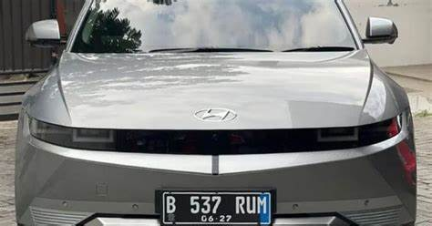
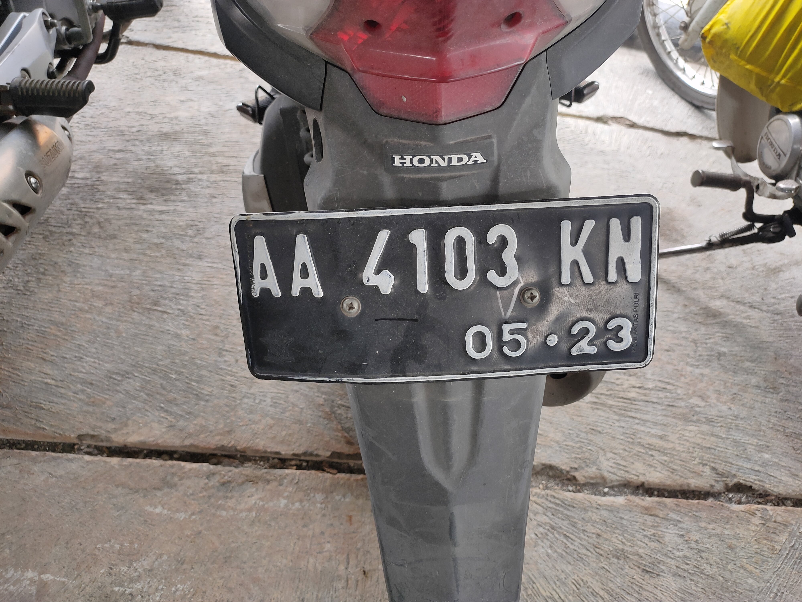
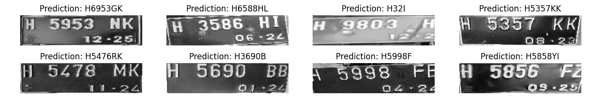

# Real Time Automatic License Plate Recognition for Vehicle Entrance Gate - Documentation

# Project Overview

This documentation outlines the development for real-time automatic Indonesian license plate recognition (ALPR) system designed for vehicle entrance gates. We focus on automating vehicle access using optical character recognition (OCR) and advanced machine learning methods to ensure flexibility, consistency, and enhanced security. In this experiment we will benchmark traditional methods as well as modern/deep learning approach to gain a better understanding of this topic.

<aside>
💡

## Quick Navigation to Demo

The demo can be accessed here:

[**https://huggingface.co/spaces/ChronoStellar/Indonesian_ALPR_model_comparison**](https://huggingface.co/spaces/ChronoStellar/Indonesian_ALPR_model_comparison)

</aside>

## Group 3 - LA01

Our group consists of:

1. Hendrik Nicolas Carlo - 2602124171
2. Ivan Setiawan - 2602109473
3. Dave Christian Thio - 2602120803

---

## 1. Problem Background

1. The need for easier and more organized license plate auditing for security systems.
2. As opposed to only relying on security team, the system is flexible and consistent even during hours when humans are most tired (afternoon/midnight) and can help the security team in their daily jobs in gate entrances.
3. Accidentally stopped the car too far away from the ticket machine, drivers have to open seat belt and open their doors.

---

## 2. System Requirements

> These libraries are used to run the code of each model, but you do not have to install these libraries in the demo.
> 

**If library installation is required (Visual Studio Code, etc.)**

- Python 3.8+
- OpenCV 4.5.0
- TensorFlow 2.x
- CUDA-compatible GPU (recommended)
- Minimum 8GB RAM

**If library installation is not required (Google Colab, etc.):**

You can run the code perfectly fine.

---

## 3. Literature Review

This project leverages insights from previous works:

1. **Template Matching in OpenCV**
    - Simple, Fast, and efficient for small datasets.
    - Less resource needed because it just uses simple matching algorithm.
    - Font dependent, based on the paper, if the testing used different fonts, it will degrade the accuracy to as low as 35% (Times New Roman) meaning that it may not generalized well.
    - The paper does not experiment with the font size and transformation, it only use fixed size. This probably means that it lack flexibility to transformation such as scale, rotation, etc.
    - Link: [https://www.researchgate.net/profile/Md-Anwar-Hossain-6/publication/333246578_Optical_Character_Recognition_based_on_Template_Matching/links/5ce429eb92851c4eabb4d86f/Optical-Character-Recognition-based-on-Template-Matching.pdf](https://www.researchgate.net/profile/Md-Anwar-Hossain-6/publication/333246578_Optical_Character_Recognition_based_on_Template_Matching/links/5ce429eb92851c4eabb4d86f/Optical-Character-Recognition-based-on-Template-Matching.pdf)
2. **Handwritten Character Recognition Using HOG and SVM**
    - Prove that HOG is effective for character recognition that we also use in this project.
    - Perform better than KNN using SVM as the classifier with the accuracy of 96.56% on HASY dataset
    - Uses handwritten (HASY) dataset which differ from our type of dataset
    - Only a single classification task, i.e. it classifies per letter
    - Link: [https://www.academia.edu/35039075/Handwritten_Character_Recognition_Using_HOG_COM_by_OpenCV_and_Python](https://www.academia.edu/35039075/Handwritten_Character_Recognition_Using_HOG_COM_by_OpenCV_and_Python)
3. **Scene Text Recognition Based on Improved CRNN**
    - Integrates CNN for feature extraction, RNN for sequence modeling, and CTC for transcription, enabling end-to-end text recognition.
    - Efficient at handling sequence recognition tasks without requiring precise segmentation of text.
    - Achieves strong results in regular text recognition scenarios with structured datasets.
    - Incorporates CTC loss, which handles the alignment of input and output sequences dynamically, eliminating the need for pre-alignment.
    - Struggles with irregular text, such as curved or distorted text in images.
    - Suffers from gradient vanishing/explosion issues due to the recurrent architecture, especially for longer sequences.
    - Lower generalization for unseen scenarios, requiring additional enhancements like label smoothing or language models.
    - Relatively slower compared to non-recurrent transformer-based models in scenarios requiring complex attention mechanisms.
    - Link: [https://www.mdpi.com/2078-2489/14/7/369](https://www.mdpi.com/2078-2489/14/7/369)
4. **TrOCR: Transformer-Based Optical Character Recognition with Pre-trained Models**
    - Doesn’t use the usual CNN, instead it uses transformer model as the encoder (./images/image transformer model) and decoder (text transformer model).
    - Uses wordpiece instead of character-based method (like in CTC) as the basic unit for more efficient resource usage.
    - TrOCR achieves state-of-the-art results on printed (which is good in our scenario), handwritten and scene text recognition with just a simple encoder-decoder model, without any post-processing steps.
    - Transformer often is slower and resource intensive when dealing with images than CNN model.
    - Link: [https://ojs.aaai.org/index.php/AAAI/article/view/26538](https://ojs.aaai.org/index.php/AAAI/article/view/26538)

---

## 4. Methodology

1. **Data Collection**: Using publicly available datasets of Indonesian license plates.
    
    Train: 250, Test: 25, except template matching with 360 templates
    
2. **Model Selection**:
    - Detection/Tracking model: Yolov8n
    - Traditional methods: Template Matching, Histogram of Gradient + Logistic Regression
    - Deep Learning methods: CRNN + CTC, TrOCR.
3. **Experimentation**: Training, evaluating, and logging model performance.
4. **Deployment**: Using Docker and Gradio.
5. **Monitoring**: Monitor the model.

---

## 5. Repository Structure

Quick access to GitHub repository: [https://github.com/ChronoStellar/Automatic-License-Plate-Recognition](https://github.com/ChronoStellar/Automatic-License-Plate-Recognition)

```
Automatic-License-Plate-Recognition/
│
├── dataset/
│   ├── hog_dataset/
│       ├── augmented/dataset
│           ├── *folder *0, 1, 2, etc.**
│       ├── raw
│           ├── *sorted & augmented dataset***
│       ├── augmenting+train.ipynb
│       └── segmenting.ipynb
│   ├── segmented/
│       ├── **images dataset**
│   ├── template/
│       ├── *folder *0, 1, 2, etc.**
│   └── test/
│       └── **images dataset**
│
├── detector_model/
│   ├── crop.py
│   └── tracking_model.pt
│
├── recognizer_model/
│   ├── CRNN_CTC/
│       ├── crnn_ctc.keras
│       ├── decoder.joblib
│       └── train+eval.ipynb
│   ├── HOG_LogRes/
│       ├── results/
│           ├── old/
│               ├── HOD_LogRes.pkl
│               ├── old-better_dataset_HOG_lR.pkl
│           ├── hog_logres_model.pkl
│       ├── eval.ipynb
│       ├── requirements.txt
│       └── train.ipynb
│   ├── TemplateMatching/
│       ├── match+eval.ipynb
│       └── requirements.txt
│   └── TrOCR/
│       └── train+eval.ipynb
│
└── README.md
```

---

## 6. Core Features

- OCR using advanced methods like CRNN and TrOCR.
- Support for low-quality image recognition.

---

## 7. Installation

Follow these steps to set up the project environment:

```
# Create virtual environment
conda create -n "ALPR" python=3.11.5 ipython

# Install dependencies
pip install -r requirements.txt
```

---

## 8. Models & Implementation Details

### 8.1 Tracking

- In this experiment, since the goal was to ultimately create a real time capable system, we found the need to first localized plates from the original image first.
    
    
    
    
    8.1.a Image of a car in urban settings, presumably right outside the vehicle entrance gate
    
    
    
    8.1.b localized image of the plate from original image
    
    From these examples we can see the process of which need to be done. By localizing the image to the plate only we can ensure that our OCR models can read only the plate and nothing else.
    
- Therefore, a detection model is needed. Here we decided to use Yolov8n to detect license plates to be localized (Identifies and isolates the specific area in the frame containing the license plate.) We fine-tuned our model using this dataset https://www.kaggle.com/datasets/imamdigmi/indonesian-plate-number which is publicly available.
    
    
    
    
    8.1.c example of detection
    
    
    
    8.1.d Confusion matrix of finetuned model
    
- The cropped license plate will be processed and extracted using these ML/DL models.

### 8.2 OCR Model Architectures

<aside>
💡

In effort to keep the experiment as consistent as possible we weren’t able to effectively use the best dataset for some of the models, namely HOG and CRNN. 

This is because they require different kind on training input so to change or add one, we need to add the other, which was not optimal. Therefore, the performance for both these models are not as great as they could be.

</aside>

### 8.2.1.1 Template Matching

- When speaking about OCR template matching is quite literally the simplest and most brutish approach. As the name suggest we simply match the templates to the target image. So, with the simplicity, it can be expected that this technique won’t yield the best result.
    
    
    Given this template we will match it to the image to the left
    
    
    
    
    
- Template matching’s algorithm in OpenCV can be summed as a technique for locating a smaller template image within a larger input image by sliding the template over the input, similar to 2D convolution. The `cv.matchTemplate()` function computes a comparison score for each position, resulting in a grayscale output where each pixel represents the match quality of that region to the template. If the input image has dimensions (W, H) and the template is (w, h), the output size will be (W-w+1, H-h+1). 
To pinpoint the best match location, `cv.minMaxLoc()` identifies the pixel with the highest (or lowest) score, marking this pixel as the top-left corner of the template’s matching region, with (w, h) defining the rectangle’s dimensions.
- Since we’re dealing with OCR here the templates are individual letters. We scrap the fonts/letter that Indonesian license plate uses and save them in our GitHub repository. To make the computing lighter we use only 10 images with variance for each class. Here is the example of the template we use.
    
    
    
    
    
    
    
    
    
    
    These letters are scrapped from Kaggle datasets:
    
    - https://www.kaggle.com/datasets/caasperart/haarcascadeplatenumber?select=H3141NB.jpg
    - https://www.kaggle.com/datasets/imamdigmi/indonesian-plate-number
    - https://www.kaggle.com/datasets/firqaaa/indonesian-vehicle-plate-numbers
    
    > We use multiple because in one dataset we couldn’t get a balanced representation of each letter, so we add the letters from similar datasets. Incidentally the main source of the data which is https://www.kaggle.com/datasets/caasperart/haarcascadeplatenumber?select=H3141NB.jpg is also the primary data for other techniques.
    > 
- The steps we employ is these experiments are:
    - Load and store Templates (36 class [A-Z and 0-9], 10 images each)
    - When load input, read shape to make sure template is smaller than the target.
    - Iterate Over Character Classes and match templates, using **`cv2.TM_CCOEFF_NORMED`**
    - Template Matching for Each Character Template (store best match, char, and loc).
    - Thresholding and Character Recognition.
    - Join each letter and return the string.
- Results:
    - Bounding Box and prediction
        
        
        
    - Inference Example and Accuracy
        
        
        
        `wer: 1.0, cer: 0.7582417582417582`
        

reference: https://docs.opencv.org/3.4/d4/dc6/tutorial_py_template_matching.html

### 8.2.1.2 Histogram of Gradient + Logistic Regression

- If template matching was just a simple algorithm, now we use a feature extraction and machine learning model with HOG and logistic regression. However, we still need to classify each letter individually
- Histogram of Gradient or HOG is a feature engineering technique by dividing the pixel of selected image into grids.  After that, the direction is extracted by analyzing the pixel density in each grid, creating the gradient magnitude and direction. The gradient magnitude is obtained by getting the root of the squared horizontal and vertical gradient (change in intensity). Then for each cell, a histogram is built by binning the orientation (kind of like quantization in histeq several course behind). The direction is computed by using an arctan formula of the horizontal and vertical gradient. In short, HOG extract the gradient and orientation of the image.
    
    
    
- Logistic Regression is a machine learning model that use regression to fit a line barrier between the class that will separate each class. It works like a 1 neuron neural network, by first taking the sum function and applying activation function at the end.
    
    Ex:
    Sum Function:
    
    $$
     z = WX + B
    $$
    
    Activation Function: 
    
    $$
    softmax(Z_i) = \frac{\exp(z_i)}{\sum_{j=1}^d \exp(z_j)} \quad 1 \leq i \leq d
    
    $$
    
    For this project, because our problem is a multiclass classification, we use SoftMax as the activation function (in terms of neural network).
    
- Since HOG + logistic regression and template matching requires different kind of dataset we diversify the data that we use the data here https://www.kaggle.com/datasets/caasperart/haarcascadeplatenumber?select=H3141NB.jpg, while template matching works better with whole fonts, HOG works better with a large amount of data with variety
    
    
    
    
    
    
    
    
    
    
- The steps we employ is these experiments are:
    - Download and organize the dataset using the Kaggle API, and extract HOG features with labels based on directory structure.
    - Split the dataset, train a logistic regression model, and visualize data/results using `matplotlib` and `seaborn`.
    - For evaluation, we load the test dataset, extract HOG features, and use a pre-trained logistic regression model for inference.
    - Preprocess test images with thresholding and contour detection for segmentation.
    - Compute evaluation metrics (CER and WER) for OCR predictions.
- Results:
    - Prediction + bounding box examples
        
        
        
    - Inference Example and Accuracy
        
        
        
        `wer: 0.84, cer: 0.2677595628415301`
        

### 8.2.1.3 CRNN + CTC

- Before we explored OCR with traditional and machine learning methods. Now, we will go into a more modern approach using neural networks. One such approach is by using CRNN. By using such model, we can now recognize the whole plate instead of individual letters.
- CRNN is a combination of 2 kinds of neural network, CNN and RNN and CTC as the loss function
    
    
    
    CRNN architecture
    
    To fully understand what CRNN could do, we need to learn what each components do.
    
    1. Convolutional Neural Network (CNN)
        - Convolution Neural Network (CNN) is a type of deep learning model designed to process images or data that has a grid pattern.  CNNs are widely used in image classification, object detection, or semantic segmentation. They process input images as tensors, where the spatial dimensions (height and weight) and depth (for example: RGB Channels) are preserved during operations.
        - It uses layers of what is called as Convolutional layers to automatically and adaptively learn spatial hierarchies of features from input data.  CNNs process input through a series of layers that perform specific operations:
            - Convolution Layer: Extracts spatial features using kernels/filters
            - ReLU Layer: Introduces non-linearity by setting negative values to zero
            - Pooling Layer: Reduces the spatial dimensions but still retain essential information
            - Fully Connected Layer: Connects the flattened output of the previous layers to predict the final class.
            
            
            
        - Convolution involves sliding a small matrix (kernel) over the input tensor to calculate a weighted sum at each spatial location. The purpose of convolution operation is to detect patterns such as edges or textures in an image. For example, Sobel operators as filters to highlight vertical and horizontal edges.
            
            
            
        
        - In CNN, back propagation is also very important. The gradients are efficiently computed using a layer-wise error propagation mechanism so that CNN training is feasible even for larger networks.
            - Forward Pass
                
                Sequentially pass data through each layer to compute the output.
                
            - Backward Pass
                
                Use the gradients of the loss function, with respect to the weights. Then updates the weights of the kernels.
                
            - Gradient Descent
                
                Adjust the weights iteratively to minimize loss function by using a method like Stochastic Gradient Descent (SGD)
                
        
        Reference: https://cs.nju.edu.cn/wujx/paper/CNN.pdf
        
    2. Recurrent Neural Network (RNN)
        - RNNs are a type of neural network to handle sequential data. Unlike feedforward networks, RNNs allow information to persist across time steps for feedback loops. RNNs use their internal states to retain information about the previous time steps and is able to model temporal dependencies. However, RNNs have a weakness which is the *vanishing gradient problem.* When training with standard backpropagation through time (BPTT), gradients can vanish exponentially and limits the RNN’s ability to learn long-term dependencies (as noted in the papers’ discussion of error propagation and challenges of standard RNNs).
        - In this case, we use LSTM. LSTM introduce memory cells and gating mechanisms to address the limitations of standard RNNs.
            
            
            
        
         
        
        - **LSTM is better because of these key features:**
            - Memory Cells with Constant Error Flow
                
                LSTM memory cells allow information to flow uninterrupted and overcomes the vanishing gradient problem in standard RNNs. This is achieved using a Constant Error Carousel (CEC), which maintains error flow within the cell for extended periods.
                
            - Gating Mechanisms
                - Input Gate controls how much of the new input information to store in the memory cell
                - Forget Gate decides what part of the memory to discard when it is no longer needed. This gate prevents memory cells from growing unboundedly in continuous tasks.
                - Output Gate regulates how much information from the memory cell is sent to the next layer, or as the output.
            - Gradient-Based Learning
                
                LSTM combines Backpropagation Through time (BPTT) and Real-Time Recurrent Learning (RTRL) to train memory blocks while preserving gradients across time steps.
                
        - **How does LSTM process sequences?**
            1. Input at Each Time Step
            
            $$
            
            \text{Input to the LSTM unit:} \\
            x_t = \text{Input at time step } t \\
            h_{t-1} = \text{Hidden state at time step } t-1 \\
            C_{t-1} = \text{Cell state at time step } t-1
            
            $$
            
            1. Gating Operations
            
            Forget Gate:
            
            $$
            f_t = \sigma(W_f [h_{t-1}, x_t] + b_f)
            $$
            
            Input Gate:
            
            $$
            i_t = \sigma(W_i [h_{t-1}, x_t] + b_i)
            $$
            
            Candidate Memory Update
            
            $$
            \tilde{C}_t = \tanh(W_c [h_{t-1}, x_t] + b_c)
            $$
            
            1. Memory Cell Update
            
            $$
            C_t = f_t \cdot C_{t-1} + i_t \cdot \tilde{C}_t
            $$
            
            1. Generate Output
                
                Output Gate
                
            
            $$
            o_t = \sigma(W_o [h_{t-1}, x_t] + b_o)
            $$
            
                    Hidden State Update
            
            $$
            h_t = o_t \cdot \tanh(C_t)
            $$
            
        
        Reference: https://arxiv.org/pdf/1909.09586
        
    3. Connectionist Temporal Classification (CTC)
        - CTC is a specialized loss function and training algorithm used for sequence-to-sequence tasks where the alignment between input and output is not predefined. Particularly useful in OCR, speech recognition, and handwriting recognition.
        - **CTC Decode Operation**
            
            The process consists of 2 steps:
            
            1. Merge repeated labels: Consecutive identical characters are combined
            2. Remove blank characters: A special blank token “-” introduced by CTC is removed to preserve meaningful repetitions.
            
            
            
        
        - **CTC Loss Calculation**
            
            CTC calculates loss as the negative log of the probability of generating the ground truth (GT) from the network’s predictions.
            
            1. SoftMax Outputs: The network predicts a probability distribution over the vocabulary (e.g., {A, B, -} for each time step.
            2. Path Probability: CTC sums the probabilities of all possible paths that align with the ground truth using the CTC decode operation. For example, For GT `"AB"`, valid paths might include `ABB`, `AAB`, `AB-`, and others.
            
            Loss Formula
            
            $$
            \text{CTC Loss} = -\log(\text{Probability of Ground Truth})
            $$
            
            **Why Use `-log(probability)` Instead of `(1 - probability)`?**
            
            CTC loss when there is a perfect match
            
            
            
            CTC loss when there is perfect mismatch
            
            
            
            - For perfect match (probability = 1):
                - Both loss functions give value of 0
            - For perfect mismatch (probability → 0):
                - (1-probability) has maximum penalty of 1
                - -log(probability) gives infinite penalty
            
            This means -log(probability) is a more effective loss function as it gives strong penalty for incorrect predictions.
            
        
        Reference: https://wandb.ai/authors/text-recognition-crnn-ctc/reports/Text-Recognition-with-CRNN-CTC-Network--VmlldzoxNTI5NDI
        
- CRNN works by combining all those 3 components into a single comprehensive model. Since we’re working with both computer vision and some natural language processing this is where CNN and RNN comes into play respectively. Then CTC will act as the decoder and loss function.
    
    
    - CNN acts as the feature extractor, this is done by splitting the text image into time states as shown in the image to the right.
    - From each sequence Bi-LSTM will process the input and learn the placement of where letters or numbers are placed.
    - Finally, CTC decodes the discontinuous output from LSTM into a whole and comprehensive words.
    
    *These process makes it possible for a CRNN model to learn the context/format of the image.
    
    
    
- As for the dataset we opt to use the same Kaggle dataset as before https://www.kaggle.com/datasets/caasperart/haarcascadeplatenumber?select=H3141NB.jpg, but here we use the whole plate. Before the data can be used however, we need to preprocess the data first.
    
    
    Raw data
    
    
    
    Localized
    
    
    
    By performing this preprocessing task, we were able to get 250 clean and labeled high quality images.
    
    Previously we also tried another dataset https://www.kaggle.com/datasets/firqaaa/indonesian-vehicle-plate-numbers, in this dataset the quality is subpar, but it makes up in quantity because it is semi synthetic (manual edit by changing the numbers) this resulted in 894 somewhat unique data.
    
    
    
    However, we found that this dataset is not good enough in terms of variety and quality, so we decided to drop this dataset.
    
- In our experiment we decided to make the CRNN model from scratch based on Keras-OCR for captcha, which is available in hugging face for inference and the source code is available at https://keras.io/examples/vision/captcha_ocr/. The base model is used for captcha and while there are other models that are trained on printed text dataset like mjsynth, we ultimately decided to go with training own model because of data combability issues (captcha≠license plate)
However, a plain model might not perform very well so we thought of using MobileNet as the feature extractor, but we also faced some problem
    - Awkward input shape of 224x224 for license plate which is typically resembles 224x56 in width x height more. We solved this by padding the image to 224x224, after resizing to 224x56.
    - ImageNet weight does not specialize in Optical Character Recognition but more into general object detection.
    - The result of experiment proves to not improve much even with this addition. So, in the end we use the best model we got which uses bare CNN.
- Result
    - Training Graph
        
        In 100 epochs, we were only able to get `loss: 16.5467 - val_loss: 86.5675`
        
        
        
    - Validation result
        
        
        
        *this is purely to show that the model can somewhat recognize known plates.
        
    - Inference Examples & Accuracy
        
        
        
        `wer: 0.96, cer: 0.6703296703296703`
        

### 8.2.1.4 TrOCR

- For our final model we decided to use a transformer-based model, that is TrOCR. TrOCR was published in 2019 by Microsoft and was released in several forms; small, base, large; printed and handwritten. In our case the printed text models have the most correlation with our project so we decided to fine tune the base printed model. The base model that we’re using was trained on the [**SROIE dataset**](https://rrc.cvc.uab.es/?ch=13). It was introduced in the paper [**TrOCR: Transformer-based Optical Character Recognition with Pre-trained Models**](https://arxiv.org/abs/2109.10282) by Li et al. and first released in [**this repository**](https://github.com/microsoft/unilm/tree/master/trocr), and also in this [hugging face repository](https://huggingface.co/microsoft/trocr-base-printed).
- TrOCR Architecture
    
    
    
    As we have discussed OCR is quite the complicated task. It requires a complex pipeline with not only detection and recognition model, but also a language model. That’s why a transformer model which is commonly used for NLP task can be used here. TrOCR (Transformer-based Optical Character Recognition) is an advanced OCR model that integrates a vision Transformer (ViT) as the encoder and a text Transformer (BERT-like) as the decoder, forming an encoder-decoder architecture. 
    
    > Unlike older deep learning OCR models, TrOCR eliminates the need for a CNN backbone or external language models, leveraging Transformer-based mechanisms for both image processing and text generation.
    > 
    - **Key Features of TrOCR’s Architecture**
        1. **Input Processing**
            - Images are resized to a resolution of 384x384 pixels. Since we follow Dosovitskiy’s ViT encoder architecture the input shape follows the same convention.
            - The resized image is split into fixed-size patches (16x16 pixels), each treated as a token input for the Transformer encoder. This makes the attention layers able to better pick up the more important region.
            - Absolute position embeddings are added to preserve spatial information.
        2. **Encoder-Decoder Architecture**
            - **Encoder:**
                - The encoder is based on the Vision Transformer (ViT), initialized from BEiT weights.
                - Processes images as sequences of visual tokens without relying on a CNN backbone.
            - **Decoder:**
                - The text decoder, initialized with RoBERTa weights, autoregressively generates tokens.
                - Incorporates self-attention layers for efficient sequence generation.
        3. **Self-Attention Mechanism**
            - Self-attention is used in both encoder and decoder layers to capture global dependencies within the image patches and generated text tokens.
            - By employing self-attention layers on encoder blocks the input sequence can ‘attend’ to itself, meaning each position (as in the patches) in the input sequence can attend to all other positions, capturing long-range dependencies and contextual information.
            - In the decoder self-attention layers allow the target sequence to attend to itself but it cannot attend to future tokens, this is called masked self-attention. This is done so the model doesn’t peek forward when generating texts.
            - Multi-head attention is an extension of the self-attention mechanism, allowing the model to jointly attend to information from different representation subspaces at different positions. This is achieved by linearly transforming the queries(Q), keys(K), and values(V) multiple times, and then concatenating the results.
            - Self-attention layers allow the model to learn long range dependency, contextual understanding, and parallel computation with multi head attention.
    - **Why Transformers for OCR?**
        - Transformers like ViT analyze images as sequences of patches, embedding each patch with positional encodings. This approach allows the model to leverage self-attention for understanding global image context.
        - Compared to CNNs, ViTs are better suited for tasks requiring long-range dependencies and contextual understanding, making them ideal for OCR.
    - **How the TrOCR Encoder Works**
        - The encoder processes image patches through linear embedding and positional encoding, feeding them into a stack of Transformer layers.
        - Techniques like **Cross-Shaped Window Self-Attention** (CSWin) in some Transformer backbones enhance efficiency by analyzing different image regions simultaneously.
- As for the dataset we use the same one as the CRNN CTC model, we also tried both of datasets, but the difference is minimal even though the current dataset yields better result.
- Results
    - Training Graph
        
        
        
    - Inference Example and accuracy
        
        
        
        `wer: 0.24, cer: 0.038461538461538464`
        

---

## 9. Performance Metrics

Highest Overall Error Rate (Worst)

Lowest Overall Error Rate (Best)

| Method | Word Error Rate (WER) | Character Error Rate(CER) |
| --- | --- | --- |
| Template Matching | 100% | 75.82% |
| Histogram of Gradient + Logistic Regression | 84% | 26.77% |
| CRNN + CTC | 96% | 67.03% |
| TrOCR | 24% | 3.84% |

Formulas:

- Word Error Rate (WER)
    
    $$
    {WER} = \frac{S + D + I}{N}
    $$
    
    Where:
    
    - S = Number of substitutions
    - D = Number of deletions
    - I = Number of insertions
    - N = Total number of words in the reference
- Character Error Rate (CER)
    
    $$
    {CER} = \frac{S + D + I}{C}
    $$
    
    Where:
    
    - S = Number of substitutions
    - D = Number of deletions
    - I = Number of insertions
    - C = Total number of characters in the reference

---

## 10. Findings & Conclusion

- Template Matching as a method is not at all reliable, given the test set we weren’t able to get a single correct prediction. This makes sense since multiple entity matching is noticeably harder compared to singular match, therefore the results do make sense. Another reason is the the sheer variety needed to make the model even able to compete is beyond what we were allocate since the technique itself wasn’t the most promising.
- Histogram of Gradients with logistic regression as the classification model actually surpassed our initial expectations. Even though we have to rely at contour detection to get the bounding box of each letter so it’s not always accurate especially to rotation and skewed images, the hog as feature extractor itself was able to predict each letter pretty well. However, since it is the whole plate that we need to predict this model shows its weakness, that being the non-existent language model. Without any plate text generation rule the model confuses a lot of letters and numbers.
Although an interesting observation is that with a custom dataset that we made (augmentations and such) we were able to achieve a better result. The model can be tried [here](https://huggingface.co/spaces/ChronoStellar/IndonesianALPR_HOG_LogisticRegression) at Hugging Face space.
- CRNN model was the one we put the most hours into but the task itself proves to be a difficult one with the data scarcity and some incompatibilities with current publicly available models, while part of it were our own stubbornness to create our own model. The results while a bit disappointing shows us that while the model performs horridly most of the time to unseen data with different quality compared to the one used while training, the model was able to pick up on the contexts of the text of Alphabet-Number-Alphabet.
- TrOCR was by far the best model, the only downside was the long inference time.
- We also found that data quality matters a lot for our project.
    
    
    
    
    **Previous Dataset**
    Character Localization + Augmentation = **Better HOG model (0.7 WER)**
    
    
    
    **Current Dataset**
    
    Plate Localization with Yolov8 from raw data = **better CRNN and TrOCR**
    

---

## 11. Future Improvements

- Using Custom Synthetic Data
- Better data augmentation for HOG
- Alignment Algorithm/ model in the pipeline
- Stronger/ better pretrained model
- Fine tuning the current model on another dataset

---

## 13. Demo and Repository

- **Hugging Face Demo**:
[ALPR Model Comparison](https://huggingface.co/spaces/ChronoStellar/Indonesian_ALPR_model_comparison)
- **Repository**:
[GitHub Project Link](https://github.com/ChronoStellar/Automatic-License-Plate-Recognition)